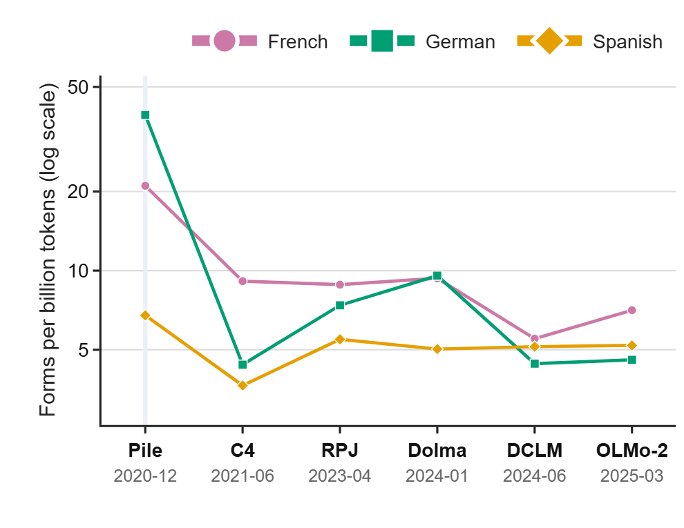

# Gender-inclusive forms in LLM pre-training corpora

This repository includes code for the **Gender Bias Beyond Stereotypes: Towards Linguistically Gender-Fair Conversational LLMs** position paper accepted to GeBNLP 2026. In addition to our theoretical contribution, we conduct a small experiment to measure how often gender-inclusive word forms occur in the text corpora used to pre-train language models. Counts are obtained from the [infini-gram](https://infini-gram.readthedocs.io/en/latest/api.html) API, across seven corpora whose approximate cutoff dates range from December 2020 (the Pile) to March 2025 (OLMo 2).

<p align="center">
  
</p>

GFL usage is measured for three languages (French, German and Spanish). For French, 512 manually verified masculine human nouns are queried with 5 GFL typographic marking strategies (middot, parentheses, dot, brackets, slash). For German, a list of 4,627 singular and plural gender-star forms from [the diversifx project](https://github.com/diversifix/diversifix/blob/refs/heads/main/data/dereko/star.txt) are queried. For Spanish, 1,596 plural forms marked with `-x` are queried.

## Usage

Configuration relies on [Hydra](https://hydra.cc/docs/intro/) and is stored in `conf/`.

The main script is `query_infinigram.py`, which collects counts and writes them to `results/<lang>/results.json`.

Plots can be created using `plot.py`.

Make sure to install [`uv`](https://github.com/astral-sh/uv) before running the scripts:

```
pip install uv
```

### Retrieving Spanish data

For Spanish specifically, given that there was no public GFL data available, we had to extract GFL forms from social media corpora. Instructions on how to reproduce the Spanish data collection are available in [data/es/README.md](data/es/README.md).

### Collecting counts

```
uv run query_infinigram.py language=[fr|de|es] # French, German or Spanish
```

Counts are written to `results/<lang>/results.json` after every word. Some words may fail to be queried due to network issues or because the API is busy. In that case, the script will continue with the next word. You can always restart the script later to retry failed queries, and the script will skip words that have already been successfully queried.

The French results are keyed by the masculine plural noun, then strategy, then corpus.

```json
{
  "étudiants": {
    "middot": {
      "v4_dolma-v1_7_llama": { "count": 1234, "approx": false }
    },
    "middot_sg": {
      "v4_dolma-v1_7_llama": { "count": 567, "approx": false }
    }
  }
}
```

`_sg`: singular form,
`_pl`: plural form,
`_pl2`: plural form with double marking (e.g., "étudiant·e·s").

The German and Spanish results have no strategy level:

```json
{
  "Abiturient*innen": {
    "v4_dolma-v1_7_llama": { "count": 1234, "approx": false }
  }
}
```

## Adding a language

Languages can be added by creating a new YAML file in `conf/language/`, with the ISO 639-1 code as its name. The `code` field inside the file names the output directory `results/<code>/` and should match the file name.

### Flat word lists

Example with Spanish and a CSV file:

```yaml
code: es
files:
  - data/es/words/es_x_nouns.csv
columns:
  - inclusive_x_pl
```

For text files (e.g., German), `columns` can be left out:

```yaml
code: de
files:
  - data/de/words/star.txt
dedupe_ignore_case: true
```

### Words with several marking strategies

Example with French:

```yaml
code: fr
key_column: masculine_word
columns:
  middot: full_suffix_middot
  slash: full_suffix_slash
  middot_sg: full_suffix_middot_sg
  slash_sg: full_suffix_slash_sg
files:
  - data/fr/suffix_maps/fr_forms.csv
restrict:
  file: data/fr/restricted_nouns.csv
  column: RawNounPlural
```

`restrict` can be used to keep only the words whose `key_column` value appears in the given column of another file (this is what is done to restrict to manually verified human nouns only).

### Additional options

`dedupe_ignore_case`: If true, collapses spellings that differ only in case, keeping the least capitalized one. Only applies to flat word lists. Default: false.
`logs_level`: Logging level (DEBUG, INFO, WARNING, ERROR, CRITICAL). Default: INFO.


## Plotting

```
uv run plot.py fr=results/fr/results.json de=results/de/results.json es=results/es/results.json
```

## Citation

TODO
